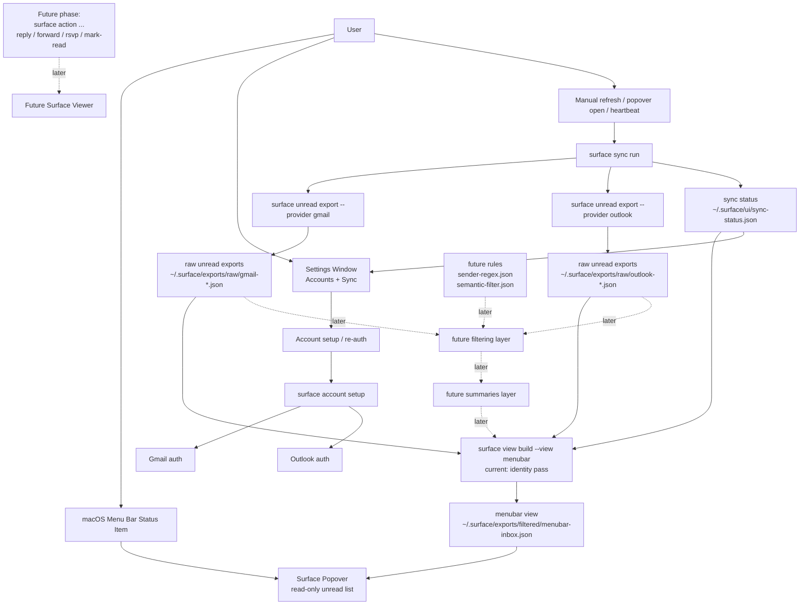

# Menu Bar Popover Architecture

## Purpose

This document defines the first frontend target for Surface: a read-only macOS menu bar popover that shows surfaced unread mail without reimplementing provider logic in the app.

The current build target is intentionally narrow:

- build a read-only menu bar popover first
- build a proper macOS Settings window for auth and sync configuration
- defer quick actions, provider action CLIs, and the detailed viewer until the read path is stable

## Product Boundary

Surface is an attention layer over mail, not a provider replacement.

That means:

- providers remain the source of truth for mailbox state
- raw unread exports remain canonical provider output
- the menu bar app reads a derived frontend-facing view artifact

The popover should answer:

- what is unread right now?
- how is it grouped by mailbox?
- which items are invites?

It should not act like a full mail client in the first phase.

## Core Principles

### 1. Raw unread export is canonical

The frontend must not rewrite `~/.surface/exports/raw/*.json`.

Providers emit canonical unread exports in `surface.unread_mail.v1`.
The menu bar app reads a separate derived view artifact.

### 2. The menu bar app stays provider-agnostic

The macOS app should not know Gmail MIME quirks, Outlook selectors, or auth internals.

It should interact with Surface through:

- stable CLI commands
- stable JSON artifacts

### 3. Settings and auth do not belong in the popover

Following macOS HIG, the popover stays transient.

Account setup, re-auth, and sync configuration belong in a standard Settings window, not inside the popover.

### 4. The first read path is an identity pass

The current backend view build does not filter, block, or summarize yet.

For now:

- every unread email from the raw exports is included in the menubar view
- the view builder only reshapes raw exports into a frontend-friendly contract
- sync status is attached so the UI can show freshness/errors

### 5. Filtering and summaries are later pipeline layers

When blocking and summarization are added, they should remain outside provider export code.

Planned later pipeline:

1. raw unread/search export
2. filtering post-process
3. summarization post-process
4. frontend view build

Blocked mail should not appear in the menu bar contract at all.
If diagnostics are needed later, keep them in separate debug/status artifacts rather than in the popover payload.

## Current System Shape

Recommended local state layout:

```text
~/.surface/
  providers/
    gmail/
      client_secret.json
  accounts/
    outlook/
      work/
        config.json
        profile/
    gmail/
      personal/
        config.json
        token.json
  exports/
    raw/
      outlook-work-unread.json
      gmail-personal-unread.json
    derived/
      ...thread-summaries.json
    filtered/
      menubar-inbox.json
  ui/
    sync-status.json
  rules/
    sender-regex.json
    semantic-filter.json
```

Meaning:

- `exports/raw/`: canonical unread exports from providers
- `exports/derived/`: separate derived artifacts such as thread summaries
- `exports/filtered/menubar-inbox.json`: the one artifact the popover reads
- `ui/sync-status.json`: sync bookkeeping for the app
- `rules/`: future blocking/filtering rules, not active in the current build

## Current Backend Commands

The menu bar app should depend on these commands:

```bash
surface sync run
surface view build --view menubar
```

### `surface sync run`

Current behavior:

- discovers ready configured accounts
- refreshes unread exports for those accounts
- writes sync bookkeeping to `~/.surface/ui/sync-status.json`
- rebuilds the menubar view artifact

For Outlook, this command should run headless because it is intended for background refresh.

### `surface view build --view menubar`

Current behavior:

- reads existing raw unread exports from `~/.surface/exports/raw/`
- reads current sync status
- reshapes all unread emails into one frontend-facing view contract
- writes `~/.surface/exports/filtered/menubar-inbox.json`

Current non-behavior:

- no sender regex blocking
- no semantic filtering
- no LLM summaries
- no quick actions

## Future Derived Pipeline

This is the planned layering after the read-only path is stable.

### Filtering layer

A separate filtering step should consume raw unread/search exports and apply:

- sender regex blocking
- semantic include/exclude prompting

The output should keep the same core unread/search structure so later pipeline stages can reuse it.

### Summarization layer

Summaries should live in their own derived artifact, not inside raw exports.

Recommended pattern:

- raw unread export:
  - `~/.surface/exports/raw/gmail-personal-unread.json`
- filtered unread export:
  - `~/.surface/exports/filtered/gmail-personal-unread.json`
- derived thread summaries:
  - `~/.surface/exports/derived/gmail-personal-unread-thread-summaries.json`
- final menubar view:
  - `~/.surface/exports/filtered/menubar-inbox.json`

That keeps:

- raw provider output canonical
- filtering reusable across unread/search
- summaries reusable across different frontends
- the menu bar contract focused on display data only

## Menubar View Contract

The menu bar app reads one frontend-facing contract:

- `contracts/filtered-menubar-v1.schema.json`

Current top-level shape:

```json
{
  "contract": "surface.filtered_menubar.v1",
  "generated_at": "2026-03-20T15:04:00+00:00",
  "selection_mode": "unread",
  "item_count": 12,
  "mailbox_count": 3,
  "sync_status": {
    "state": "idle",
    "last_attempt_at": "2026-03-20T15:03:57+00:00",
    "last_success_at": "2026-03-20T15:04:00+00:00",
    "next_scheduled_at": null,
    "error": null,
    "account_error_count": 0
  },
  "mailboxes": []
}
```

Current per-mailbox fields:

- `provider`
- `account`
- `label`
- `email_address`
- `unread_count`
- `items`

Current per-item fields:

- `provider`
- `account`
- `message_id`
- `conversation_id`
- `conversation_thread_id`
- `internet_message_id`
- `sender_primary`
- `sender_email`
- `subject`
- `preview`
- `received_at`
- `relative_time`
- `thread_message_count`
- `can_rsvp`
- `available_actions`
- `meeting`

Notably absent in the current contract:

- blocked/excluded item counts
- semantic decision metadata
- summaries

Those are future layers, not part of the first read-only popover contract.

### Example payload

```json
{
  "contract": "surface.filtered_menubar.v1",
  "generated_at": "2026-03-20T15:04:00+00:00",
  "selection_mode": "unread",
  "item_count": 1,
  "mailbox_count": 1,
  "sync_status": {
    "state": "idle",
    "last_attempt_at": "2026-03-20T15:03:57+00:00",
    "last_success_at": "2026-03-20T15:04:00+00:00",
    "next_scheduled_at": null,
    "error": null,
    "account_error_count": 0
  },
  "mailboxes": [
    {
      "provider": "gmail",
      "account": "personal",
      "label": "personal",
      "email_address": "jainvishal2212@gmail.com",
      "unread_count": 1,
      "items": [
        {
          "provider": "gmail",
          "account": "personal",
          "message_id": "19c8aa2572b9014f",
          "conversation_id": "19c8aa2572b9014f",
          "conversation_thread_id": "19c8aa2572b9014f",
          "internet_message_id": "<example@gmail.com>",
          "sender_primary": "Buzzanca, Giorgio (PATH - LUMC)",
          "sender_email": "g.buzzanca@lumc.nl",
          "subject": "Meeting Vishal",
          "preview": "Microsoft Teams meeting invitation",
          "received_at": "2026-02-23T13:13:38+00:00",
          "relative_time": "3w",
          "thread_message_count": 1,
          "can_rsvp": true,
          "available_actions": [
            "AcceptItem",
            "TentativelyAcceptItem",
            "DeclineItem"
          ],
          "meeting": {
            "request_type": "REQUEST",
            "response_type": "NEEDS-ACTION",
            "organizer": {
              "name": "Buzzanca, Giorgio (PATH - LUMC)",
              "email": "g.buzzanca@lumc.nl"
            },
            "location": "Riunione Microsoft Teams",
            "start": "2026-02-23T13:00:00+00:00",
            "end": "2026-02-23T14:00:00+00:00",
            "available_rsvp_actions": [
              "AcceptItem",
              "TentativelyAcceptItem",
              "DeclineItem"
            ]
          }
        }
      ]
    }
  ]
}
```

## End-to-End Architecture



This diagram should stay aligned with:

- `contracts/filtered-menubar-v1.schema.json`
- `docs/cli-architecture.md`
- `docs/provider-architecture.md`
- the actual CLI in `surface_cli/main.py`

## Sync Policy

Recommended defaults:

- default heartbeat: `5m`
- allowed presets: `1m`, `2m`, `5m`, `10m`, `15m`, `30m`, `60m`
- refresh on popover open: yes
- refresh on wake: yes
- refresh on network reconnect: yes

Recommended popover-visible sync states:

- `idle`
- `syncing`
- `partial`
- `error`

The popover should show:

- last successful sync time
- whether a sync is in progress
- whether any accounts failed

## Popover Requirements

The first popover should support:

- grouped unread mail across mailboxes
- mailbox dividers and counts
- inline row expansion
- reading concise unread details
- manual refresh
- opening Settings
- showing sync status

The first popover should not support:

- account setup
- re-auth
- quick reply / forward / RSVP
- full mailbox browsing
- provider handoff
- detailed viewer

### Information density

Recommended collapsed row content:

- sender
- subject
- relative time
- invite chip if applicable

Do not show preview/summary on every row by default.

Recommended expanded row content:

- preview text
- for invites: date/time and location details

### Grouping

Rows should be grouped by mailbox, not by provider only.

Example:

- Gmail / personal
- Outlook / work
- Outlook / personal

## Settings Window Requirements

The first macOS app should provide a standard Settings window reachable from:

- the app menu
- `Cmd+,`
- an optional Settings button in the popover

Recommended initial sections:

- `Accounts`
- `Sync`

### Accounts section

The `Accounts` section should support:

- listing configured accounts
- provider and account label display
- status display:
  - `Ready`
  - `Auth Required`
  - `Sync Error`
- `Add Account`
- `Re-auth`
- `Remove Account`

### Sync section

The `Sync` section should support:

- interval preset selection
- `Sync Now`
- refresh-on-open toggle
- later: launch at login

## Auth And Sign-In Flow

The app should not implement Gmail or Outlook auth directly.
It should delegate to Surface.

Recommended flow:

1. User opens `Settings > Accounts`.
2. User clicks `Add Account`.
3. User chooses provider and enters an account label/slug.
4. The app invokes the existing backend setup flow:
   - `surface account setup --provider gmail --account ...`
   - `surface account setup --provider outlook --account ...`
5. Gmail opens the browser OAuth flow.
6. Outlook opens the browser/bootstrap flow.
7. On completion, the app refreshes account state and the next sync rebuilds the menubar view.

Important distinction:

- local development may still require first-machine Gmail OAuth client bootstrap
- end users should not need to understand provider internals
- the app should present this as a standard account connection flow

## macOS Command Model

Following macOS HIG, the app should expose standard desktop commands even if the feature set is small.

Recommended early commands:

- `Settings...` on `Cmd+,`
- `Refresh` on `Cmd+R`
- `Quit Surface` on `Cmd+Q`

Keyboard expectations for the popover:

- arrow keys move selection
- `Space` expands a row
- `Cmd+,` opens Settings
- `Esc` closes the popover

## Future Viewer Boundary

The popover is a triage surface.
The richer viewer is a later workbench.

Recommended later viewer shape:

- left column: surfaced message list grouped by mailbox
- main column: selected thread
- right-side drawer only when composing reply/forward

Do not design the popover as a tiny full mail client.
